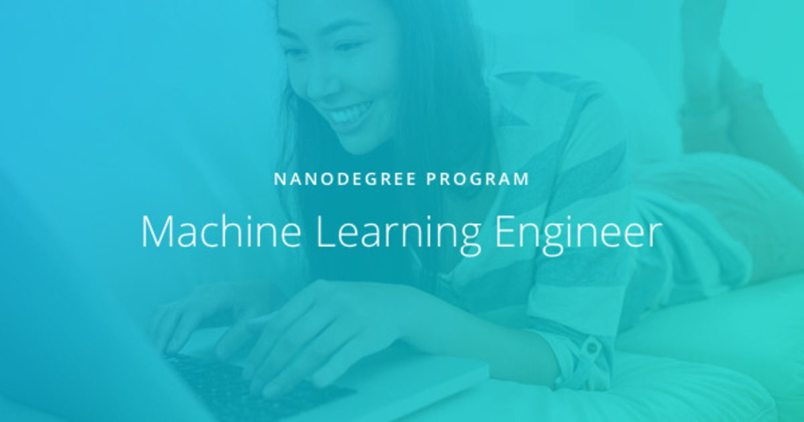

# Machine Learning Engineer Nanodegree

**Objectives:** Build predictive models using a variety of unsupervised and supervised machine learning techniques. Understand cloud deployment terminology and best practices. Use Amazon SageMaker to deploy machine learning models to production environments, such a sa web application or piece of hardware. A/B test two different deployed models and evaluate their performance. Utilize an API to deploy a model to a website such that it responds to user input, dynamically. Update a deployed model, in response to changes in the underlying data source.

 

**Projects:**

- *Machine Learning in Production. Deploy a Sentiment Analysis Model.*

  Using SageMaker, deploy a PyTorch sentiment analysis model, which is trained to recognize the sentiment of movie reviews (positive or negative).

  - Project: work in progress (deadline 31 October 2019)

- *Machine Learning Case Studies. Plagiarism Detector.*

  Engineer features that can help identify cases of plagiarism in text and deploy a trained plagiarism detection model using Amazon SageMaker.

  - Project: work in progress  (deadline 31 October 2019)

- *Machine Learning Capstone Project*

  A final project that involves data exploration and machine learning.
  
  - [Project Specification](https://github.com/JrVerbiest/Udacity_Machine_Learning_Engineer_Nanodegree/blob/master/Capstone%20Project/Capstone%20Project%20Specification.md)
  - [Project Proposal](https://github.com/JrVerbiest/Udacity_Machine_Learning_Engineer_Nanodegree/blob/master/Capstone%20Project/Proposal.pdf) and [review from Udacity](https://github.com/JrVerbiest/Udacity_Machine_Learning_Engineer_Nanodegree/blob/master/Capstone%20Project/Capstone%20Proposal%20Review.md)
  - Project: work in progress  (deadline 28 November 2019)

 

---

*Last update: 23 September 2019*